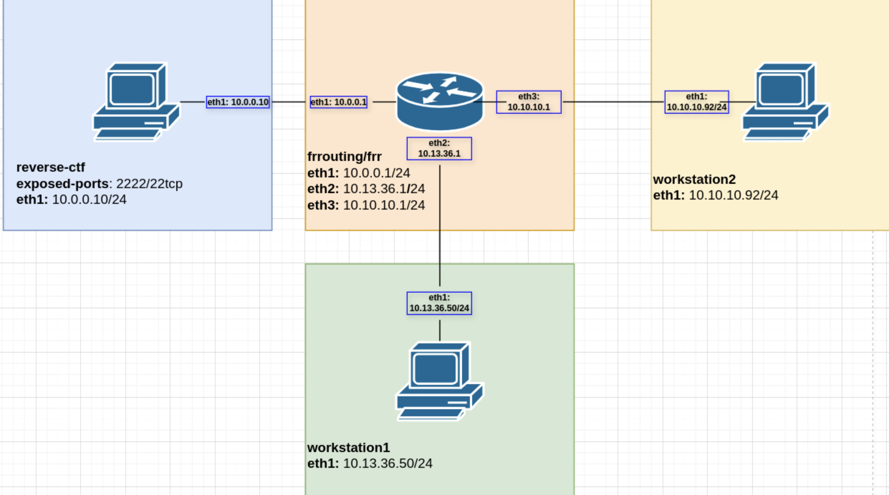

# CHALLENGE

## challenge.000.000

```bash
ssh challenge.000.000@10.13.37.10
```

```
ls
```

## challenge.000.001

```bash
ssh challenge.000.001@10.13.37.10
```

```
ls
```

## challenge.000.002

```bash
ssh challenge.000.002@10.13.37.10
```

```
ls
```

## challenge.000.003
> Same steps as when we set up the reverse test server (you can look back as the Hello containerlab in my network_ad.md)


```bash
ssh challenge.000.003@10.13.37.10
```

```
./reverse-ctf.sh 10.13.37.69
```

### *remember to sudo containerlab destroy -a after finished

## challenge.000.004
> Same steps as when we do one router one pc (you can look back as the Connect test-server to a router in my network_ad.md)

But this time change the ip address as for the reverse-ctf is 10.12.36.50 (not 10.0.0.5) 0& 10.13.36.1/24 (not 10.0.0.1) is for the routing

### All other stuff are the same but for this part
## Configuration

### r1: 
```bash
docker exec -it clab-test_to_server-r1 vtysh
```

```shell
configure terminal
interface eth1
ip address 10.13.36.1/24
end
write memory
show interface brief
```

### test

```bash
docker exec -it clab-test_to_server-reverse-ctf sh
```

```sh
apk update
apk add iproute2

ip addr add 10.13.36.50/24 dev eth1 
ip link set eth1 up

ip route add default via 10.13.36.1
```

```bash
sudo containerlab deploy -t server.yml
```
```bash
ssh challenge.000.004@10.13.37.10
```
```
./reverse-ctf.sh 10.13.37.69
```

## challenge.000.005


this is 3 pc with one router

## Create a new topology
```
name: router-static
topology:
 nodes:
   r1:
     kind: linux
     image: frrouting/frr:latest


   workstation1:
     kind: linux
     image: alpine:latest


   workstation2:
     kind: linux
     image: alpine:latest
    
   reverse-ctf:
     kind: linux
     image: reverse-ctf-server
     ports:
       - "2222:22/tcp"
 links:
   - endpoints: ['r1:eth1', 'reverse-ctf:eth1']
   - endpoints: ['r1:eth2', 'workstation1:eth1']
   - endpoints: ['r1:eth3', 'workstation2:eth1']
```

## Reverse-ctf
```bash
docker exec -it clab-router-static-r1 vtysh
r1# configure terminal
r1(config)# interface eth1
r1(config-if)# ip address 10.0.0.1/24
r1(config-if)# interface eth2
r1(config-if)# ip address 10.13.36.1/24
r1(config-if)# interface eth3
r1(config-if)# ip address 10.10.10.1/24
r1(config-if)# end
r1# write memory

r1# show interface brief
Interface   	Status  VRF         	Addresses
---------   	------  ---         	---------
eth0        	up  	default     	172.20.20.5/24
                                    	+ 2001:172:20:20::5/64
eth1        	up  	default     	10.0.0.1/24
eth2        	up  	default     	10.13.36.1/24
eth3        	up  	default     	10.10.10.1/24
lo          	up  	default    	 
r1# show ip route
Codes: K - kernel route, C - connected, S - static, R - RIP,
   	O - OSPF, I - IS-IS, B - BGP, E - EIGRP, N - NHRP,
   	T - Table, v - VNC, V - VNC-Direct, A - Babel, F - PBR,
   	f - OpenFabric,
   	> - selected route, * - FIB route, q - queued, r - rejected, b - backup
   	t - trapped, o - offload failure
```

```bash
docker exec -it clab-router-static-reverse-ctf sh
/ # apk update
/ # apk add iproute2
/ # ip address add 10.0.0.10/24 dev eth1
/ # ip route show
default via 172.20.20.1 dev eth0
10.0.0.0/24 dev eth1 proto kernel scope link src 10.0.0.10
172.20.20.0/24 dev eth0 proto kernel scope link src 172.20.20.4
/ # ip route del default via 172.20.20.1 dev eth0
/ # ip route add default via 10.0.0.1  dev eth1
/ # ip a s
/ # ip route show
default via 10.0.0.1 dev eth1
10.0.0.0/24 dev eth1 proto kernel scope link src 10.0.0.10
172.20.20.0/24 dev eth0 proto kernel scope link src 172.20.20.4
```
```bash
/ # ping 10.0.0.10
/ # ping 10.0.0.1
/ # ping 10.13.36.1

```

## Workstation 1
```bash
docker exec -it clab-router-static-workstation1 sh
/ # apk update
/ # apk  add iproute2
/ # ip route show
default via 172.20.20.1 dev eth0
10.13.36.0/24 dev eth1 proto kernel scope link src 10.13.36.50
172.20.20.0/24 dev eth0 proto kernel scope link src 172.20.20.2
/ # ip route del default via 172.20.20.1 dev eth0
/ # ip route add default via 10.13.36.1 dev eth1
/ # ip a s
```

```bash
/ # ping 10.0.0.10
```
## Workstation 2

```bash
docker exec -it  clab-router-static-workstation2 sh
/ # apk update && apk add iproute2
/ # ip addr add 10.10.10.92/24 dev eth1
/ # ip route show
default via 172.20.20.1 dev eth0
10.10.10.0/24 dev eth1 proto kernel scope link src 10.10.10.92
172.20.20.0/24 dev eth0 proto kernel scope link src 172.20.20.3
/ # ip route del default via 172.20.20.1 dev eth0
/ # ip route add default via 10.10.10.1 dev eth1
/ # ip a s
(to see if 57: eth0@if58: <BROADCAST,MULTICAST,UP,LOWER_UP-> up)
```
then ping all of it
```bash
/ # ping 10.0.0.10
```


