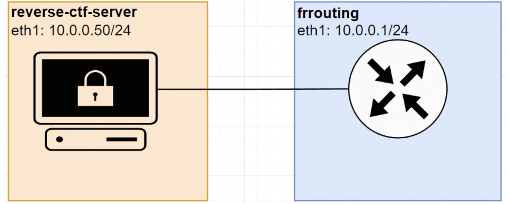
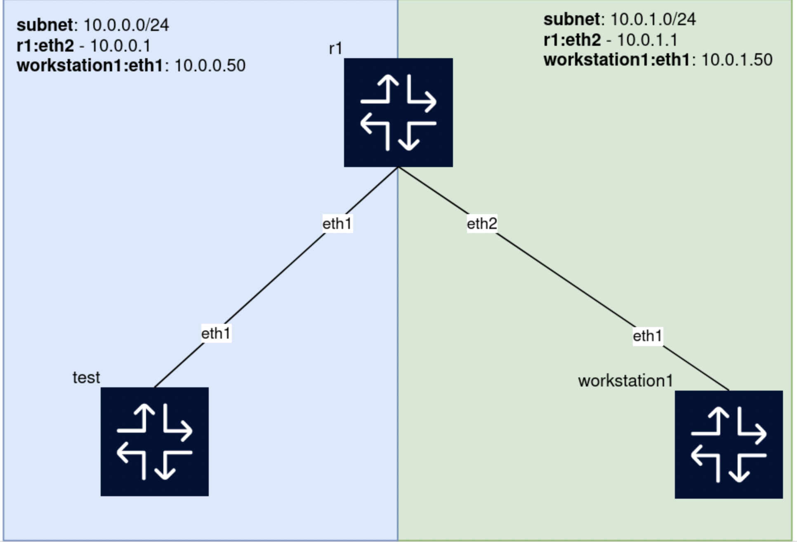

## Network Administration
#### NGAN NGO- NETWORKING SECURITY ⚙️⌨️

# Hello containerlab
(Deploy the reverse CTF test machine for networking and security)
### Create a topology file

```yaml
name: reverse_ctf_tester
topology:
  nodes:
    ssss:
      kind: linux
      image: reverse-ctf-server
      ports:
        - "2222:22/tcp"
```

```bash
sudo containerlab destroy -a
sudo containerlab inspect -a
sudo containerlab deploy -t hello.yml
```

```
ssh networking000@10.13.37.10
./reverse-ctf.sh 10.13.37.69
```

# Connect test-server to a router
## Set router with single static network


## Create a topology file

```yaml
name: test_to_server
topology:
  nodes:
    reverse-ctf:
      kind: linux
      image: frrouting/frr:latest
    test:
      kind: linux
      image: reverse-ctf-server
      ports:
        - "2222:22/tcp"
  links: 
    - endpoints: ['reverse-ctf:eth1', 'test:eth1']
```

```bash
sudo containerlab destroy -a
sudo containerlab inspect -a
sudo containerlab deploy -t server.yml
```
## Configuration

### r1: 

```bash
docker exec -it clab-test_to_server-r1 vtysh
```

```shell
configure terminal
interface eth1
ip address 10.0.0.1/24
end
write memory
show interface brief
```

### test

```bash
docker exec -it clab-test_to_server-reverse-ctf sh
```

```sh
apk update
apk add iproute2

ip addr add 10.0.0.50/24 dev eth1 
ip link set eth1 up

ip route add default via 10.0.0.1
```

```bash
sudo containerlab deploy -t server.yml
```

### Go to terminal
```
sudo containerlab inspect -a

ssh testuser@localhost -p 2222 (pass: testuser)
ip a
ip a | grep 10.13.37

ssh networking001@10.13.37.10
./reverse-ctf.sh 10.13.37.69
```

# Set router with single static network
## Two networks; one router


```bash
sudo containerlab destroy -a
```

## Create a topology file

Create a new working directory and make a new topology file in there. 

```bash
mkdir ~/class>/clab/routing1pc -p
cd ~/network>/clab/routing1pc
touch topology.yml
```

Now either open that file in visual studio code or use nano to edit

```bash
nano topology.yml
```

```yaml
name: test-router-static
topology:
  nodes:
    r1:
      kind: linux
      image: frrouting/frr:latest

    workstation1:
      kind: linux
      image: alpine:latest

    test:
      kind: linux
      image: reverse-ctf-server
      ports:
        - "2222:22/tcp"
  links: 
    - endpoints: ['r1:eth1', 'test:eth1']
    - endpoints: ['r1:eth2', 'workstation1:eth1']
```

and then build 

```bash
sudo containerlab destroy -a
sudo containerlab inspect -a
sudo containerlab deploy -t topology.yml
```
```bash
sudo docker exec -it clab-test-router-static-r1 vtysh
```
```sh
r1# configure terminal
r1(config)# interface eth1 
r1(config-if)# ip address 10.0.0.1/24
r1(config-if)# interface eth2
r1(config-if)# ip address 10.0.1.1/24
r1(config-if)# end
r1# show interface brief
r1# show ip route
write memory
exit
```
Check our names again

```bash
sudo containerlab inspect -a
```

```bash
sudo docker exec -it clab-test-router-static-test sh
```

Set up the machine

```bash
apk update
apk add iproute2

ip addr add 10.0.0.50/24 dev eth1 
ip link set eth1 up
```
The routing table

```sh
ip route show
default via 172.20.20.1 dev eth0 
10.0.0.0/24 dev eth1 proto kernel scope link src 10.0.0.50 
172.20.20.0/24 dev eth0 proto kernel scope link src 172.20.20.2 
```
remove that default route and change it so we have two default routes with different weightings 

```sh
ip route del default via 172.20.20.1 dev eth0
ip route add default via 10.0.0.1 dev eth1 metric 100
ip route add default via 172.20.20.1 dev eth0 metric 200


ip route show
default via 10.0.0.1 dev eth1 metric 100 
default via 172.20.20.1 dev eth0 metric 200 
10.0.0.0/24 dev eth1 proto kernel scope link src 10.0.0.50 
172.20.20.0/24 dev eth0 proto kernel scope link src 172.20.20.2 
```
```bash
ping -c 4 10.0.0.1
ping -c 4 10.0.1.1
```
### Go to host terminal
```
sudo containerlab inspect -a
```

### Go to workstation
```
docker exec -it clab-test-router-static-workstation1 sh
```

```sh
apk update
apk add iproute2

ip addr add 10.0.1.50/24 dev eth1 
ip link set eth1 up


ip route del default via  172.20.20.1 dev eth0
ip route add default via 10.0.1.1 dev eth1 metric 100
ip route add default via 172.20.20.1 dev eth0 metric 200


ping -c 4 10.0.1.1
ping -c 4 10.0.0.1
ping -c 4 10.0.0.50
```
Last step
```
ssh networking002@10.13.37.10
./reverse-ctf.sh 10.13.37.69
```
